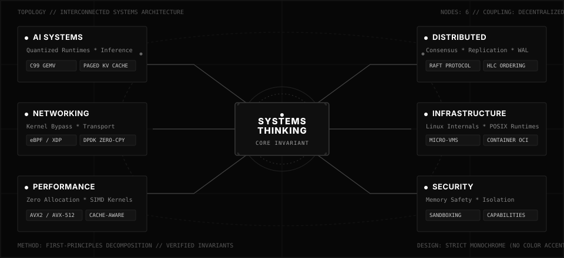
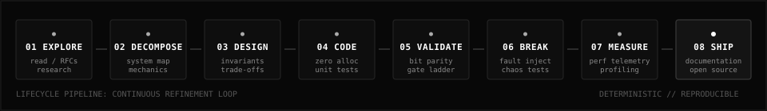

<div align="center">



</div>

<br />

```text
==================================================================================================
IDENTITY        : BHARGAV PODAPATI
ROLE            : TECHNICAL FOUNDER / SYSTEMS ENGINEER
FOCUS           : SYSTEMS * AI INFRASTRUCTURE * DISTRIBUTED RUNTIMES
LOCATION        : BENGALURU, INDIA [12.9716° N, 77.5946° E]
STATUS          : ACTIVE / OPEN SOURCE SYSTEMS
==================================================================================================
```

---

## 01. CURRENT MISSION

> **Building autonomous software engineering systems.**

I am a technical founder focused on AI systems, distributed systems, developer infrastructure, and low-level software engineering. I build software from first principles: decomposing abstractions, optimizing memory layouts, and creating deterministic, zero-dependency runtimes.

<br />

<table>
<tr>
<td width="25%" align="center" bgcolor="#0A0A0A">
<code><b>AI SYSTEMS</b></code><br />
<small>Quantized runtimes, fused SIMD kernels, paged KV cache, MoE routing</small>
</td>
<td width="25%" align="center" bgcolor="#0A0A0A">
<code><b>DISTRIBUTED SYSTEMS</b></code><br />
<small>Raft consensus, WAL durability, tunable quorums, hybrid logical clocks</small>
</td>
<td width="25%" align="center" bgcolor="#0A0A0A">
<code><b>INFRASTRUCTURE</b></code><br />
<small>Linux internals, micro-VMs, container runtimes, deterministic simulation</small>
</td>
<td width="25%" align="center" bgcolor="#0A0A0A">
<code><b>LOW-LEVEL RUNTIMES</b></code><br />
<small>C99 / C++17 / Rust, zero-allocation hot paths, memory mapping, POSIX</small>
</td>
</tr>
</table>

---

## 02. ENGINEERING MAP

An interconnected view of core systems disciplines and engineering focus areas:

<div align="center">

</div>

---

## 03. WHAT I BUILD

```text
+-----------------------+-------------------------------------------------------------------------+
| DOMAIN                | CORE FOCUS & SUB-SYSTEMS                                                |
+-----------------------+-------------------------------------------------------------------------+
| AI INFRASTRUCTURE     | LLM runtimes, fused SIMD GEMV, quantization (Q8/Q4), sparse MoE routing |
|                       | paged KV caches, speculative decoding, multi-index retrieval (RAG)      |
+-----------------------+-------------------------------------------------------------------------+
| DISTRIBUTED SYSTEMS   | Raft consensus, leader election, log replication, consistent hashing   |
|                       | quorum consistency (R+W>N), Hybrid Logical Clocks, crash recovery WAL  |
+-----------------------+-------------------------------------------------------------------------+
| SYSTEMS PROGRAMMING   | C99, C++17, Rust, POSIX APIs, zero-copy memory mapping, memory arenas  |
|                       | process trees, signal propagation, job control, AST execution pipelines |
+-----------------------+-------------------------------------------------------------------------+
| NETWORKING & KERNEL   | Kernel-bypass packet filtering (eBPF/XDP), zero-copy DPDK rings         |
|                       | custom UDP/TCP transports, network topology simulation, fault injection |
+-----------------------+-------------------------------------------------------------------------+
| INFRASTRUCTURE        | Linux internals, micro-VM sandboxing, OCI container runtime internals   |
|                       | deterministic simulation testing (DST), CI/CD pipelines, observability  |
+-----------------------+-------------------------------------------------------------------------+
```

---

## 04. SELECTED SYSTEMS

<table>
<tr>
<td width="50%" valign="top" bgcolor="#0A0A0A">

### ◈ [`quantr-in-c`](https://github.com/bharqav/quantr-in-c)
**Portable C99 Quantized LLM & MoE Inference Engine**

High-performance contextual AI execution without Python, PyTorch, BLAS, or runtime dependencies.

* **Zero Hot-Path Allocations**: Strict memory arena architecture with zero dynamic heap allocation during token generation.
* **Fused Integer SIMD**: Vectorized GEMV kernels supporting AVX2, AVX-512 VNNI, and ARM NEON with scalar fallback.
* **Paged KV Cache**: Quantized Q8_0 key-value memory management for unbounded context scaling.
* **Sparse MoE Execution**: Dynamic router evaluating only active expert blocks per token.
* **Zero-Copy Loading**: Memory-mapped checkpoints via POSIX `mmap` / Windows `MapViewOfFile`.

```text
STACK : C99 · AVX2 / AVX-512 · NEON · OpenMP · POSIX / Win32
LINK  : github.com/bharqav/quantr-in-c
```

</td>
<td width="50%" valign="top" bgcolor="#0A0A0A">

### ◈ [`distributed-kv-store`](https://github.com/bharqav/distributed-kv-store)
**Fault-Tolerant Distributed Persistence Engine**

Clustered persistence engine built from first principles to model consensus and replication mechanics.

* **Raft Consensus Protocol**: Leader election, heartbeat timers, log replication, and cluster reconfiguration.
* **Consistent Hash Ring**: Stateless coordinator with virtual token ring for balanced distribution.
* **Tunable Quorums**: Configurable read/write quorums (`R + W > N`) with vector clock / HLC causal ordering.
* **Append-Only WAL**: Crash-safe Write-Ahead Logging with snapshot recovery and compaction.
* **Deterministic Simulation**: Test harnesses verifying split-brain resistance and network partitions.

```text
STACK : Python 3.11+ / Go · Raft · Consistent Hashing · WAL · HLC
LINK  : github.com/bharqav/distributed-kv-store
```

</td>
</tr>
<tr>
<td width="50%" valign="top" bgcolor="#0A0A0A">

### ◈ [`mysh`](https://github.com/bharqav/mysh)
**POSIX-Compatible Mini-Shell & Process Engine**

Systems-level command interpreter and process lifecycle manager in C++17.

* **Recursive-Descent Parser**: AST construction with strict operator precedence (`&&`, `||`, `|`, `;`).
* **Process Lifecycles**: Strict management via `fork()`, `execvp()`, `waitpid()`, and process group tracking.
* **I/O Redirections & Pipelines**: File descriptor manipulation using `pipe()` and `dup2()` chains.
* **Job Control & Signals**: Foreground and background process execution with custom signal masking (`SIGINT`, `SIGTSTP`, `SIGCHLD`).
* **Environment & Variable Expansion**: Deterministic variable scoping and builtin execution.

```text
STACK : C++17 · POSIX System Calls · AST · Process Management
LINK  : github.com/bharqav/mysh
```

</td>
<td width="50%" valign="top" bgcolor="#0A0A0A">

### ◈ [`ultimate-hybrid-rag`](https://github.com/bharqav/ultimate-hybrid-rag)
**Offline-First Multi-Index Retrieval Engine**

Modular information retrieval engine combining dense, sparse, and late-interaction representations.

* **Hybrid Retriever Stack**: Concurrent evaluation of Dense Vector, BM25, SPLADE, and ColBERT indexes.
* **Reciprocal Rank Fusion**: RRF scoring across disparate rank distributions.
* **Cross-Encoder Reranking**: Two-stage neural reranking with dynamic score normalization.
* **Sub-10ms Latency**: Concurrent semantic chunking and zero-copy vector scoring.
* **Reproducible Benchmarking**: Automated precision/recall gate evaluation suites.

```text
STACK : Python 3.11 · PyTorch · ColBERT · BM25 · SPLADE · RRF
LINK  : github.com/bharqav/ultimate-hybrid-rag
```

</td>
</tr>
</table>

---

## 05. OPEN SOURCE & EXTERNAL SYSTEMS

Case studies of contributions and investigations in open-source systems:

<table>
<tr>
<td width="33%" valign="top" bgcolor="#0A0A0A">

#### ◈ MICROSOFT OPENVMM
`Hypervisor / VirtIO Transport`

* **Target**: Open-source virtualization infrastructure and hypervisor stack.
* **Contribution (PR #4226)**: Fixed spurious configuration-change interrupt emitted during the `DRIVER_OK` state transition by proving driver activation does not alter device configuration.
* **Focus**: Audited `INTx/MSI-X` and MMIO interrupt signaling paths, ensuring `config_generation` strictly increments only during `FEATURES_OK` negotiation.

</td>
<td width="33%" valign="top" bgcolor="#0A0A0A">

#### ◈ CRUCIBLE SECURITY
`AI Red-Teaming & Security Gating`

* **Target**: Systems security and agent vulnerability assessment tooling.
* **Contribution (PR #64 / Issue #49 & #52)**: Built adversarial attack module covering OWASP AGENT-004 (Tool Misuse) across MCP-enabled agent fleets (4 attack classes, 20 vectors, 286+ tests).
* **Focus**: Engineered `--fail-on` severity threshold CLI flag for CI/CD pipelines and reusable GitHub Actions scanning workflows.

</td>
<td width="33%" valign="top" bgcolor="#0A0A0A">

#### ◈ YOUKI
`Rust OCI Container Runtime`

* **Target**: Low-level container runtime implemented in Rust.
* **Contribution (PR #3688)**: Piped `--memory`, `--memory-reservation`, and `--memory-swap` through `LinuxMemoryBuilder` into the kernel cgroup controller layer.
* **Focus**: Corrected CLI types to signed `Option<i64>` to safely represent `-1` unlimited allocations with regression integration coverage for `memory.max`.

</td>
</tr>
</table>

---

## 06. HOW I BUILD

System development follows a repeatable, verification-driven engineering pipeline:

<div align="center">

</div>

<br />

```text
01. EXPLORE    -> Read specifications, RFCs, kernel source, and hardware instruction manuals.
02. DECOMPOSE  -> Break systems into stateless components, isolate mutable state, map dataflow.
03. DESIGN     -> Define formal invariants, memory layout contracts, and concurrency models.
04. IMPLEMENT  -> Write zero-allocation hot paths, cache-aware structs, and minimal interfaces.
05. VALIDATE   -> Enforce bit-exact mathematical parity and automated gate ladders.
06. BREAK      -> Inject faults, trigger simulated partitions, and test boundary conditions.
07. MEASURE    -> Profile CPU cycles, cache miss rates, memory RSS, and tail latency percentiles.
08. SHIP       -> Provide clean documentation, single-file amalgamations, and open-source builds.
```

---

## 07. ENGINEERING PHILOSOPHY

```text
1. UNDERSTAND THE SYSTEM BEFORE ABSTRACTING IT.
   If you cannot write the underlying component from scratch, your abstraction is a guess.

2. MEASURE BEFORE OPTIMIZING.
   Intuition is unreliable in complex runtimes. Measure cache misses, allocations, and cycle counts.

3. DESIGN FAILURE PATHS BEFORE HAPPY PATHS.
   Distributed nodes fail, memory exhaustions happen, networks partition. Systems are defined by resilience.

4. PREFER EXPLICIT SYSTEMS OVER MAGIC.
   Zero hidden allocations, zero unmapped threads, zero opaque runtime reflection.

5. BUILD FROM FIRST PRINCIPLES WHEN ABSTRACTIONS HIDE CRITICAL MECHANICS.
   When performance, determinism, or safety matter, remove intermediate layers.
```

---

## 08. TECHNICAL MATRIX

<table>
<tr>
<th align="left" bgcolor="#141414">CATEGORY</th>
<th align="left" bgcolor="#141414">TECHNOLOGIES & DOMAINS</th>
</tr>
<tr>
<td bgcolor="#0A0A0A"><b>LANGUAGES</b></td>
<td bgcolor="#0A0A0A"><code>C (C99)</code> · <code>C++ (C++17/20)</code> · <code>Rust</code> · <code>Go</code> · <code>Python (3.11+)</code> · <code>TypeScript</code></td>
</tr>
<tr>
<td bgcolor="#0A0A0A"><b>SYSTEMS & RUNTIMES</b></td>
<td bgcolor="#0A0A0A"><code>POSIX System Calls</code> · <code>Linux Internals</code> · <code>SIMD (AVX2 / AVX-512 / NEON)</code> · <code>mmap</code> · <code>Memory Arenas</code> · <code>Process Groups</code></td>
</tr>
<tr>
<td bgcolor="#0A0A0A"><b>DISTRIBUTED</b></td>
<td bgcolor="#0A0A0A"><code>Raft Consensus</code> · <code>Write-Ahead Logging (WAL)</code> · <code>Consistent Hashing</code> · <code>Tunable Quorums</code> · <code>HLC</code></td>
</tr>
<tr>
<td bgcolor="#0A0A0A"><b>AI & RETRIEVAL</b></td>
<td bgcolor="#0A0A0A"><code>Quantization (Q8_0, Q4_K)</code> · <code>Fused GEMV</code> · <code>Sparse MoE</code> · <code>Paged KV Cache</code> · <code>ColBERT / BM25 / SPLADE / RRF</code></td>
</tr>
<tr>
<td bgcolor="#0A0A0A"><b>INFRASTRUCTURE</b></td>
<td bgcolor="#0A0A0A"><code>Linux</code> · <code>Docker / OCI</code> · <code>eBPF / XDP</code> · <code>DPDK</code> · <code>CMake / Make</code> · <code>GitHub Actions</code> · <code>PostgreSQL</code> · <code>Redis</code></td>
</tr>
</table>

---

## 09. CURRENTLY EXPLORING

```text
* Autonomous Software Engineering Agents (deterministic planning, execution, and verification loops)
* Baremetal Inference Acceleration (integer arithmetic kernels and low-precision KV cache paging)
* Deterministic Simulation Testing (DST for distributed protocol fuzzing and verification)
* Micro-VM Sandboxing & Lightweight Isolation (custom isolation boundaries for untrusted execution)
```

---

## 10. CONTACT / NETWORK

```text
==================================================================================================
LET'S BUILD SOMETHING MEANINGFUL.
==================================================================================================
```

<div align="center">

[](https://github.com/bharqav)
&nbsp;
[](https://www.linkedin.com/in/podapatibhargav)
&nbsp;
[](mailto:bhargavpodapati28@gmail.com)

</div>

<br />

```text
Systems over slogans.
Build. Measure. Repeat.
```
