<div align="center">


<a href="https://github.com/bharqav">
  
</a>

<br/>


</div>

<br/>

<div align="center">
  
</div>

<br/>

<!-- SYSINFO -->
```c
/* sysinfo.c — host developer identity */
#include <stdio.h>
#include <stdint.h>

typedef struct {
    const char *name;
    const char *role;
    const char *core_focus[4];
    const char *current_kernel;
    uint32_t    favorite_flags;
} dev_t;

int main(void) {
    dev_t me = {
        .name           = "Bhargav",
        .role           = "Systems & AI Infrastructure Engineer",
        .core_focus     = { "Quantized LLM Runtimes (C99)",
                             "Virtualization (VirtIO / OpenVMM)",
                             "Container Runtimes (OCI / cgroups)",
                             "Distributed Consensus (Raft)" },
        .current_kernel = "Fused Integer GEMV on AVX2 / AVX-512 VNNI",
        .favorite_flags = (1 << 3) /* -O3 -march=native -fopenmp -Wall -Wextra */
    };

    printf("%s -> %s\n", me.name, me.role);
    return 0;
}
```

<br/>

## Open Source Contributions

<table width="100%">
<tr>
<td width="50%" valign="top">

**Crucible Security** — Tool Injection Assessment Module<br/>
`PR #64` · `Issue #49`

Built an adversarial attack engine covering OWASP AGENT-004 across MCP and tool-augmented agents. Four attack classes, twenty adversarial vectors, 286+ passing tests with dynamic attack registration.

`Python` `Security` `MCP`

</td>
<td width="50%" valign="top">

**Crucible Security** — CI/CD Security Gating<br/>
`PR #64` · `Issue #52`

Built a `--fail-on` severity threshold flag that blocks CI pipelines on HIGH/CRITICAL findings. Shipped reusable GitHub Actions templates for automated agent vulnerability scanning.

`CLI` `CI/CD` `GitHub Actions`

</td>
</tr>
<tr>
<td width="50%" valign="top">

**Microsoft OpenVMM** — VirtIO Interrupt Fix<br/>
`PR #4226`

Found and fixed a spurious config-change interrupt during the DRIVER_OK transition. Audited INTx/MSI-X/MMIO interrupt paths across transports and corrected `config_generation` increment behavior.

`Rust` `VirtIO` `Virtualization`

</td>
<td width="50%" valign="top">

**youki (OCI Runtime)** — Live Memory & cgroups v2<br/>
`PR #3688`

Fixed CLI argument propagation for `--memory`, `--memory-reservation`, and `--memory-swap` into the kernel cgroup layer. Corrected types to signed `Option<i64>` for unlimited allocations, added regression coverage.

`Rust` `cgroups` `OCI`

</td>
</tr>
</table>

<br/>

## Featured Systems

<table width="100%">
<tr>
<td width="50%" valign="top">

### ⚡ quantr-in-c
Zero-dependency quantized LLM/MoE inference in portable C99.

- Fused SIMD GEMV using `_mm256_maddubs_epi16` and `_mm512_dpbusd_epi32`
- 15 bit-exact test gates, paged Q8_0 KV cache
- Sub-200MB peak RSS on 30B models

</td>
<td width="50%" valign="top">

### 🐚 mysh
Production-grade POSIX mini-shell in C++.

- Recursive AST parser for pipelines, subshells, redirection
- Real job control with foreground/background process groups
- Native directory stack, alias substitution, glob expansion

</td>
</tr>
<tr>
<td width="50%" valign="top">

### 📦 distributed-kv-store
Fault-tolerant distributed KV store from first principles.

- Raft consensus: leader election, log replication, snapshotting
- Consistent hashing with virtual tokens
- Hybrid logical clocks, append-only WAL

</td>
<td width="50%" valign="top">

### 🔍 ultimate-hybrid-rag
High-throughput hybrid vector and lexical retrieval engine.

- RRF fusion of dense embeddings and BM25 sparse indexes
- Cross-encoder neural reranking pipeline
- Sub-10ms latency on concurrent semantic chunking

</td>
</tr>
</table>

<br/>

## Technical Arsenal

<div align="center">

**Core Languages**
<br/>


**Systems & Compute**
<br/>


**Infrastructure & Data**
<br/>


**Toolchain & Build**
<br/>


</div>

<br/>

## Currently Deep-Diving Into

- **Speculative decoding acceptance proofs** — optimizing rejection sampling across batched draft verification steps
- **Zero-copy memory-mapped weight paging** — eliminating page-fault penalties on sparse 30B MoE models under DRAM constraints
- **Lock-free ring buffers and actor models** — low-latency IPC over POSIX shared memory

<br/>

<div align="center">

<a href="https://linkedin.com/in/podapatibhargav"></a>
<a href="mailto:bhargavpodapati28@gmail.com"></a>
<a href="https://github.com/bharqav"></a>

<br/><br/>


</div>
